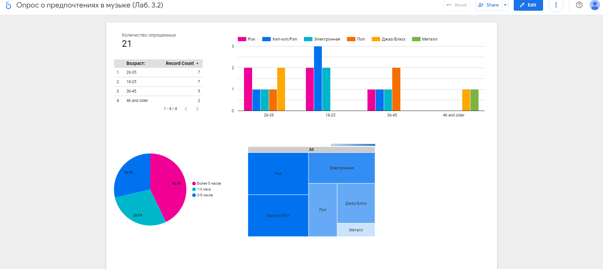
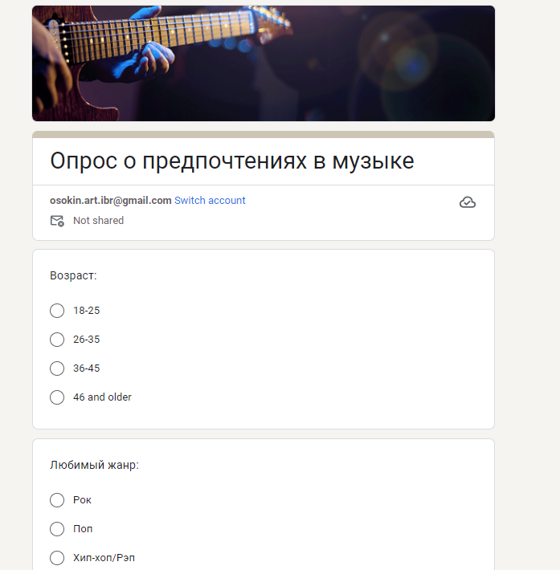

# Лабораторная работа 3.2
## Создание опроса и визуализация результатов

Опрос был выполнен в Google Forms. Для визуализации данных был использован Looker Studio в связке Google Sheets, где хранятся данных опроса. 

Обновление данных дашборда происходит раз в 15 минут (по-умолчанию)

---
Форма опроса: https://forms.gle/7YARqfpqxxJbTTyk8

Визуализация данных: https://lookerstudio.google.com/s/nqjo12JBECI

### Форма опроса

### Дашборд

